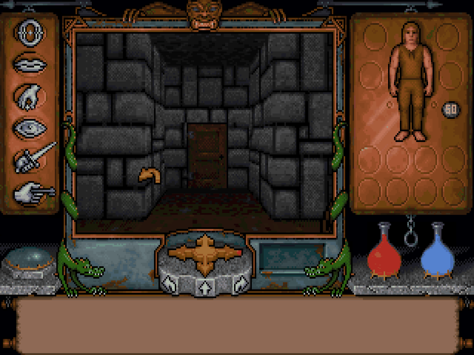
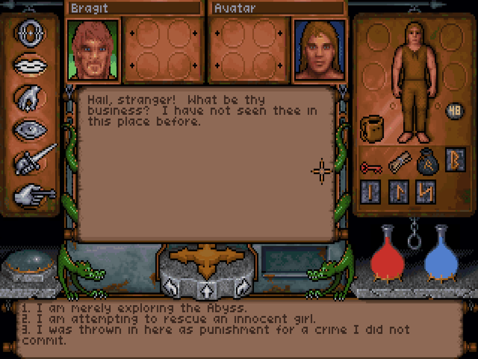
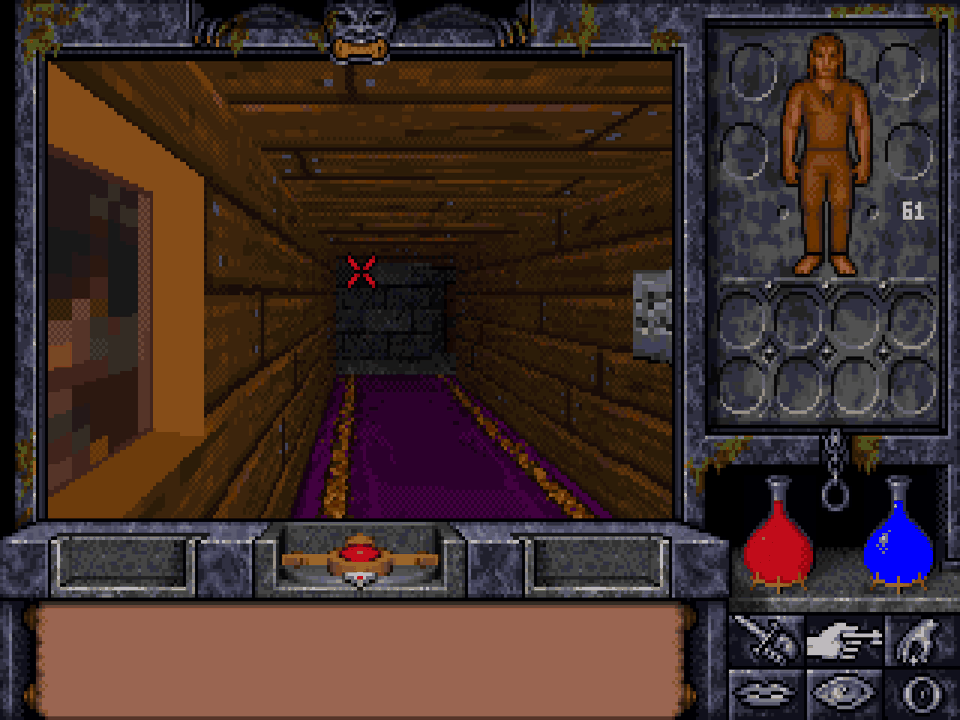
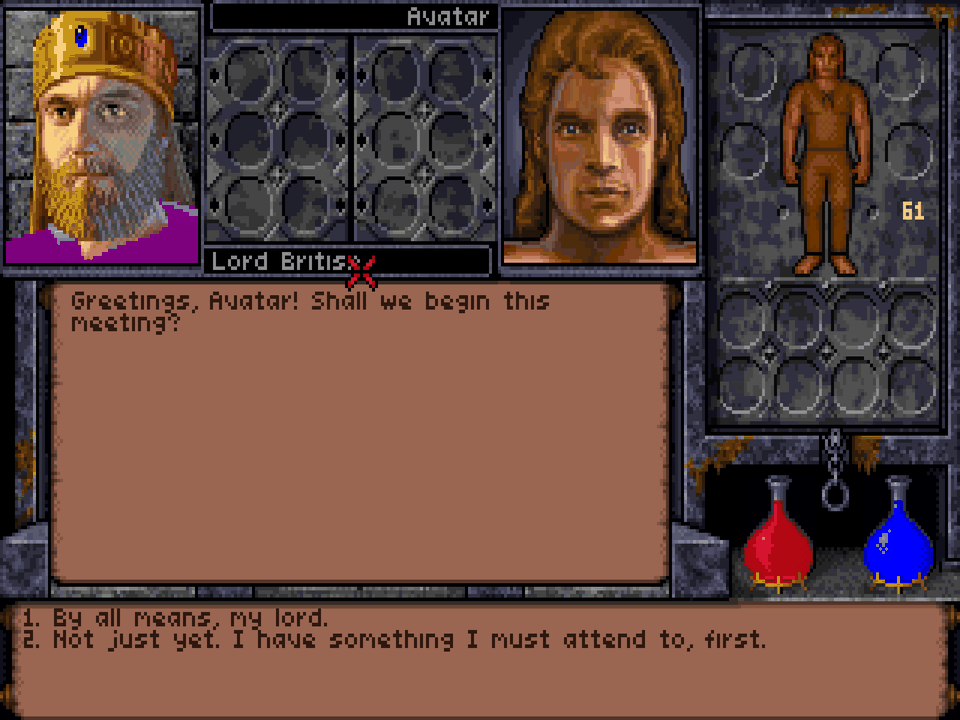

# Underworld Exhumed

**Ultima Underworld:** [](https://github.com/abedegno/underworld-exhumed/actions/workflows/uw1-accuracy.yml) [](https://github.com/abedegno/underworld-exhumed/actions/workflows/uw1-port.yml) [](https://github.com/abedegno/underworld-exhumed/releases)  
**Ultima Underworld II:** [](https://github.com/abedegno/underworld-exhumed/actions/workflows/uw2-accuracy.yml) [](https://github.com/abedegno/underworld-exhumed/actions/workflows/uw2-port.yml) [](https://github.com/abedegno/underworld-exhumed/releases)  
[](https://github.com/abedegno/underworld-exhumed/actions/workflows/repocheck.yml) [](LICENSE)

*Ultima Underworld: The Stygian Abyss* (1992) and *Ultima Underworld II: Labyrinth of Worlds* (1993), dug out of their original DOS programs. For each game there is:

- **Source code that rebuilds the original program byte for byte.** It compiles with the original Borland tools to exactly the shipped `UW.EXE` and `UW2.EXE`, with readable names, shared headers and notes on what each file does in the game.
- **A native port** for macOS, Windows and Linux, built from that same source. It plays the game in a window with its music, speech and effects, and is checked against recorded DOS sessions for every change.

*Arrived from a UW2Decomp or UW1Decomp link?* Those repositories are now [`uw2/`](uw2/README.md) and [`uw1/`](uw1/README.md) here, with their full history; an old link to a shared page (this README, `docs/BUILDING.md`) lands on the page for both games, which links to each game's own.

No game data is included: you need your own copy of each game (the GOG releases). This is a fan research project, not affiliated with or endorsed by the rights holders; see [Licence and legal notice](#licence-and-legal-notice).

## Play

| | |
| --- | --- |
|  |  |
|  |  |

*Screens from the recorded DOS sessions the ports are tested against: the ports draw exactly the same.*


1. **Download** the package for your system from [Releases](https://github.com/abedegno/underworld-exhumed/releases). Each release is for one game: `uw1-v…` releases are *Ultima Underworld*, `uw2-v…` releases are *Ultima Underworld II*.
2. **Install the game from GOG.** The port finds it in GOG's usual folders, including inside GOG's Mac app and its `game.gog` CD image, and on Windows where GOG's installer recorded it. If it finds nothing, it asks you to choose the folder, and remembers it. From a command line, `--data /path/to/game` names it.
3. **Start it:**
   - macOS: `UW1.app` or `UW2.app`. Both are signed and notarised, so they open like any app.
   - Windows: `uw1port.exe` or `uw2port.exe`.
   - Linux: the AppImage (`chmod +x`, then run it), or `./uw1` or `./uw2` from the tarball. The Linux packages need glibc 2.35 or later (Ubuntu 22.04 or newer).

The controls are the game's own: the mouse, and the keys in the game's manual. The game's cursor follows the system pointer; `--mouse lock` captures the pointer on a click instead, as DOSBox does, with Ctrl+F10 to release it.

Saved games and settings are kept in the port's home folder, never in the game folder: `~/.uw1port` or `~/.uw2port` on macOS and Linux, `%APPDATA%\uw1port` or `%APPDATA%\uw2port` on Windows.

The first run gets a Sound Blaster with FM music and digitised speech or effects. For Roland MT-32 music, give your own MT-32 or CM-32L ROM images with `--mt32-roms DIR`. `--sound` picks other cards, and `--help` lists every option. Each game's README has its sound card numbers: [uw1](uw1/README.md), [uw2](uw2/README.md).

**If something goes wrong,** [open an issue](https://github.com/abedegno/underworld-exhumed/issues/new/choose). Each play session's inputs are recorded to `recordings/` in the home folder (the newest five are kept). Zip the newest folder with the log beside it and attach it: it replays your session here exactly.

## Study and modify

Both games are byte-matching decompilations, made and checked with [Exhume](https://github.com/abedegno/Exhume), the toolkit both were built with. It is included here as a submodule.

```sh
git clone --recursive https://github.com/abedegno/underworld-exhumed.git
cd underworld-exhumed
make setup        # Exhume and its tools, then each game's setup
make port         # both ports, no Borland toolchain or game data needed
make check        # each game's gate: every source rebuilds its part of the EXE exactly
make test         # the gate, the ports, routine fuzzing and every recorded session against DOS
```

`GAME=uw1` or `GAME=uw2` runs a target for one game. [docs/BUILDING.md](docs/BUILDING.md) has the requirements, the private CI bundles and releases.

What there is to read:

| | |
| --- | --- |
| [docs/behaviour/](docs/behaviour/README.md) | what the games do, as rules with exact numbers, for game programmers and modders who don't read the C: NPC AI, schedules, combat, magic, conversations, player upkeep, traps and triggers |
| [docs/FORMATS.md](docs/FORMATS.md) | every data file both games read and write, from the code that reads it |
| [docs/UW1-UW2-DIFFERENCES.md](docs/UW1-UW2-DIFFERENCES.md) | where the two games' rules differ, routine by routine |
| [docs/PORT.md](docs/PORT.md) | how the ports work and how they are proved against DOS |
| [uw1/docs/FINDINGS.md](uw1/docs/FINDINGS.md), [uw2/docs/FINDINGS.md](uw2/docs/FINDINGS.md) | what matching revealed: likely bugs in the originals, game rules, engine details |
| `uw1/vectors/`, `uw2/vectors/` | input and output tables for game rules, made by running the original programs' code |
| `uw1/map/crosswalk.tsv`, `uw2/map/crosswalk.tsv` | every function by the IDA listing's name and address, with its matched source (`tools/crosswalk.py --find`) |

Each game folder (`uw1/`, `uw2/`) is self-contained: its sources, maps, tests and tools, its own `make`, and its own README with the details. [CONTRIBUTING.md](CONTRIBUTING.md) says how a change is proved.

## Status

| | *Ultima Underworld* (`uw1/`) | *Ultima Underworld II* (`uw2/`) |
| --- | --- | --- |
| Code matched | every code segment: 89 C files and 50 assembly modules | every code segment: 99 C files and the assembly |
| Exact link | identical to `UW.EXE` | identical to `UW2.EXE` |
| Port | ten recorded sessions identical to DOS on macOS, Linux and Windows | ten recorded sessions identical to DOS on macOS, Linux and Windows |
| Releases | release candidates (`uw1-v1.0.0-rc…`) | 1.2.0, published |

## Licence and legal notice

The project's own work (the tools, the documentation, and the comments, names and structure added to the decompiled code) is under the MIT licence ([LICENSE](LICENSE)). The decompiled code is derived from the games' programs, whose copyright belongs to their owners; the licence grants no right in it. [NOTICE](NOTICE) has the details, and each game's NOTICE and THIRD-PARTY-NOTICES the rest.
