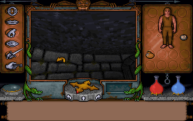
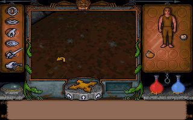
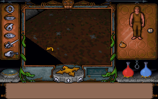

# Enhancements

The ports play the original games exactly: every recorded session replays in them identically to DOS. Enhancements are changes the original games do not have. Each is off unless you turn it on (in the settings screen, F11, on its Enhancements tab, or with `--enhance`), and a session played with any of them says so in its log and in its recording.

```
uw2port --enhance list                 the enhancements, with what each does
uw2port --enhance skip-intro           turn one on (kept for later runs)
uw2port --no-enhance skip-intro        turn it off again
```

They are kept in the settings file (`enhance=` in `uw1port.cfg` or `uw2port.cfg`, in the port's home folder). A run with any on logs `enhance: NAMES (not as DOS)`.

| Name | Games | Kind | What it does | From |
|---|---|---|---|---|
| `skip-intro` | UW1, UW2 | timing | Starts at the main menu, without the title or the introduction the game plays when there are no saved games (the menu's Introduction still plays it) | the idea from [UltimaHacks](https://github.com/JohnGlassmyer/UltimaHacks) |
| `wrap-menu` | UW1, UW2 | presentation | In the start menu and the saved games, up from the first item goes to the last and down from the last to the first | the idea from [UltimaHacks](https://github.com/JohnGlassmyer/UltimaHacks) |
| `fast-panels` | UW1, UW2 | timing | The right-hand panel slides twice as fast | the idea from [UltimaHacks](https://github.com/JohnGlassmyer/UltimaHacks) |
| `free-heading` | UW1, UW2 | gameplay | Sliding along a wall no longer turns your view to face it | the idea from [UltimaHacks](https://github.com/JohnGlassmyer/UltimaHacks) |
| `subtitles` | UW2 | presentation | Cutscenes show their text while the speech plays (the introduction's lines are text only; spoken lines are in other cutscenes) | the idea from [UltimaHacks](https://github.com/JohnGlassmyer/UltimaHacks) |
| `skill-messages` | UW2 | presentation | When a skill point or a trainer raises a skill, the conversation says which and to what | the idea from [UltimaHacks](https://github.com/JohnGlassmyer/UltimaHacks) |
| `perspective` | UW1, UW2 | presentation | Floors and ceilings (in UW1 walls too) stay straight when the view pitches. UW1: a perspective-correct texture mapper in C (`uw1/src/port/gfx/perspmap.c`) in place of the original two, covering exactly the pixels they cover. UW2: floors and ceilings (every polygon but walls) are mapped perspective-correctly when the view pitches, where the original maps some linearly; walls keep the original's vertical columns, so they can still bend slightly. Only UW1's mapper has the pixel-coverage proof below; UW2's change is checked by the presentation replays | [uwpatch](https://github.com/SiENcE/uwpatch) (UW1's mapper, translated) |
| `full-sprites` | UW1, UW2 | presentation | Creatures and objects keep their size when the view pitches. Within the original's small pitch range the difference is a pixel or so; it matters with a wider pitch | the idea from [UltimaHacks](https://github.com/JohnGlassmyer/UltimaHacks) |
| `wide-pitch` | UW1, UW2 | gameplay | Look three times as far up and down. Beyond the original's limit the game also draws the squares just behind you (without their objects), so the floor and ceiling have no gaps when you look steeply. Gameplay, since where you look decides where you aim, throw and click | [UltimaHacks](https://github.com/JohnGlassmyer/UltimaHacks) (its two-pass drawing, in C) |
| `mouse-look` | UW1, UW2 | timing | The `` ` `` key turns mouse-look on and off. While it is on, the mouse turns the view and looks up and down, the pointer stays at the view's centre as a crosshair, and clicks act there; the port captures the pointer. It turns off by itself on the map and in conversations and back on after. `look-speed=` in the settings file sets how fast it turns, as a percentage (default 100, 10 to 400). Without `wide-pitch` it looks up and down only as far as the original | the idea from [UltimaHacks](https://github.com/JohnGlassmyer/UltimaHacks) |
| `invert-look` | UW1, UW2 | presentation | Mouse-look's up and down the other way round; nothing without `mouse-look` | the idea from [UltimaHacks](https://github.com/JohnGlassmyer/UltimaHacks) |
| `modern-keys` | UW1, UW2 | timing | UltimaHacks' key layout, below, in place of the original's movement keys. Each new key acts as the click it stands for | [UltimaHacks](https://github.com/JohnGlassmyer/UltimaHacks) (its layout, exactly) |
| `rune-keys` | UW1, UW2 | presentation | Ctrl+Alt with a letter puts that rune on the shelf (Y is Ylem: there is no X rune), Ctrl+Alt+Backspace clears the shelf, Ctrl+Alt+Space casts. A rune you do not have is refused with a sound. Movement keys are ignored while Ctrl and Alt are both held | [UltimaHacks](https://github.com/JohnGlassmyer/UltimaHacks) |

**`perspective` in UW1**, the same moment looking down, off and on: the stone courses bend without it and run straight with it.

 

**`modern-keys`**, the keys:

| Keys | What they do |
|---|---|
| W, X, S | run, walk, back |
| A, D | slide left, right |
| Left, Right (the grey arrows) | turn |
| Shift, Ctrl+Shift | jump, standing long jump (J still jumps too); while flying or levitating, Shift held flies up and Ctrl down, and on the ground they do not stop other movement |
| Ctrl with the grey arrows | step forward, back, left, right by a fixed amount |
| Up, Down (the grey arrows), 1, 3 | look up, down (1 is now up); 2 and keypad 5 look ahead |
| Space | attack with the last attack type, slash at first; `.` `;` `p` still thrust, slash and bash, and set the last type |
| Q, E | look at, use, what is under the pointer (the crosshair with mouse-look); E on a person talks to them |
| Z | the map; on it S a level on, W a level back, C your own level; UW2 also D and A the previous and next world |
| R, F | the rune bag, the statistics panel (again: back to the inventory) |
| G, H | the compass, the flasks (as clicks on them) |
| C, V, B | close the open container, scroll the inventory down, up |

The keypad still moves the pointer, F1 to F10 and the Ctrl shortcuts are as before, and the conversation menus take number keys as they always did.

**`wide-pitch` in UW1**, turning while looking all the way down, with the squares behind drawn and without (a test switch, below): without them the floor behind the player is missing, here the black wedge.

 

**Kinds.** *Presentation*: how the game looks or is controlled; the game itself is unchanged, which the tests prove by replaying every session with it on. *Timing*: the same game, reached by a different path or frames. *Gameplay*: the rules change; the log adds "gameplay changed".

**How they are tested** (Exhume's `tools/enhcheck.py`, part of `make test`). With none on, every session still matches DOS, and the DOS builds are byte-identical. A presentation enhancement must leave every session's game state as DOS's; only the screen may differ. A timing or gameplay one has its own session under `tests/replay/enhanced/`, recorded from an input script (`session.script`, [BUILDING.md](BUILDING.md#input-scripts)) and starting, where it says so (`stage_from`), from the saved game another session writes, with a baseline the port made (`"made_by": "port"`), run twice and checked identical. A recording made with enhancements carries them (recording format 5): its replay turns them on, and DOS never replays it. Presentation checks ignore the screen and the graphics engine's working memory (`GFX`), which a rendering enhancement changes by design. UW1's `perspective` is also checked to cover exactly the original mappers' pixels: with `UW1PORT_TEXTURE_PROBE` each face is drawn in a colour of its own, and every checkpoint's screen of the `walk` session must be the same with the enhancement on and off. `wide-pitch`'s drawing behind the player is checked by a hole probe (`UW1PORT_HOLE_PROBE` and `UW2PORT_HOLE_PROBE`): the view is cleared to a colour it never draws and each frame reports the pixels still that colour, in its session (turning and walking while looking all the way down and up), with and without the squares behind (`UWnPORT_NO_BACK_PASS`). No frame may have more uncovered pixels with them than without, and at most a tenth as many frames any; not none, since the original itself leaves a few pixels uncovered. `modern-keys` and `rune-keys` are checked by screenshots too (`tools/enhcheck.py keys`): each moved key against the original key for the same move, each new key against the same key without the flag, and a rune key for a rune the player lacks against no key. `mouse-look` and `invert-look` are checked by screenshots: after the key the mouse turns the view where without it only the pointer moves, and inverted it pitches the other way.

**Credits.** The planned enhancements come largely from John Glassmyer's [UltimaHacks](https://github.com/JohnGlassmyer/UltimaHacks) and SiENcE's [uwpatch](https://github.com/SiENcE/uwpatch), both MIT; each game's THIRD-PARTY-NOTICES carries their notices.
