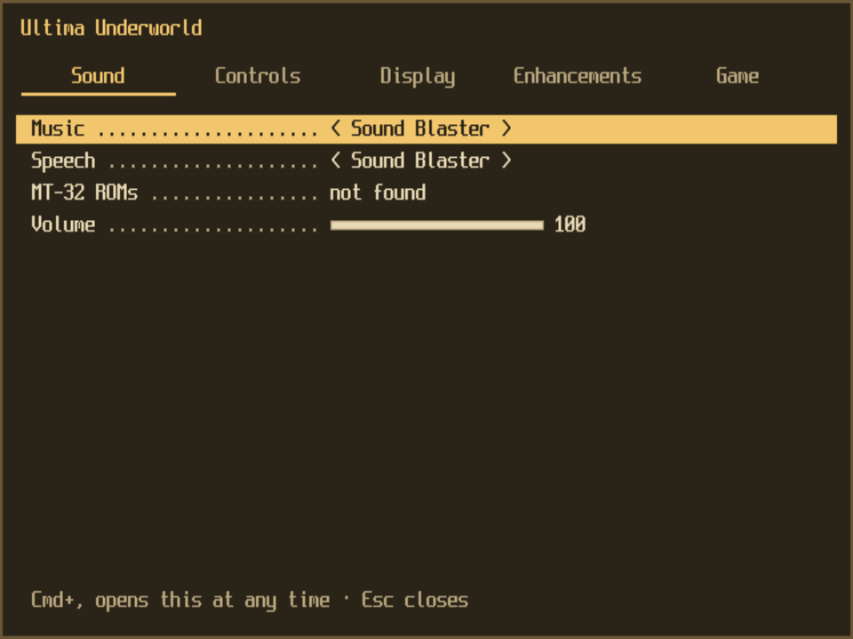
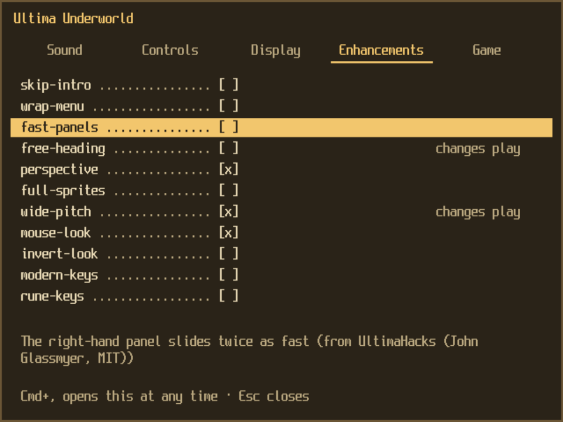

# Settings

Each port has a settings screen. Press **F11** at any time to open it over the game, and F11 or Esc to close it. On macOS press **Cmd+,** instead: the Mac takes F11 for Show Desktop, so it never reaches the game unless you turn that shortcut off (System Settings → Keyboard → Keyboard Shortcuts → Mission Control → Show Desktop). While it is open the game's clock is stopped, and keys or mouse buttons you were holding when it opened are let go when it closes.

The first time you run a port, and on every start after that unless you turn it off, the screen opens before the game, which waits for you to close it. The **Show this at start** row on the Game tab turns that off; F11 (Cmd+, on macOS) still opens it.

 

## Using it

| Keys | What they do |
|---|---|
| Up, Down | move between the rows; Up from the first row, or Down from the last, goes to the tab bar |
| Left, Right | change the row's value (on the tab bar: the previous or next tab) |
| Enter | change the row's value (a switch flips, a list goes to the next choice, a folder row opens your system's folder picker) |
| Tab | the next tab |
| F11 (Cmd+, on macOS), Esc | close the screen |

The mouse works too: click a tab, click a row to change it, drag a slider (Volume, Mouse-look speed).

Every change is written to the settings file at once. A row marked "Restart to apply" on the screen is saved but only used from the next start; the others take effect immediately. The settings file is `uw1port.cfg` or `uw2port.cfg` in the port's home folder (`~/.uw1port` or `~/.uw2port` on macOS and Linux, `%APPDATA%\uw1port` or `%APPDATA%\uw2port` on Windows). The two sound card rows are the exception: they are kept in `DATA\UW.CFG` in the home folder, the file the original install program wrote, so they have no key.

## The options

A value in the settings file that the screen cannot show (`volume=abc`, `scale=99`) is read as that option's default, both on the screen and by the game. "At once" means the change shows as soon as you make it. "Next start" means it is saved and used the next time the port starts. Options shown with no command-line option can be set only on the screen or in the file.

### Sound

| Option | What it does | Settings-file key | When | Command line |
|---|---|---|---|---|
| Music | The music card the game uses. UW1: None, PC speaker, Ad Lib, Sound Blaster, Sound Blaster Pro, Pro Audio Spectrum, Roland MT-32. UW2: None, Ad Lib, Sound Blaster, Sound Blaster Pro 1, Roland MT-32, Pro Audio Spectrum, Sound Blaster Pro 2 | none (`DATA\UW.CFG`) | next start | `--sound MUSIC[,SPEECH]` (kept) |
| Speech | The speech card: None, Sound Blaster, Sound Blaster Pro, Pro Audio Spectrum | none (`DATA\UW.CFG`) | next start | `--sound MUSIC[,SPEECH]` (kept) |
| MT-32 ROMs | The folder with your MT-32 or CM-32L ROM images, for the Roland MT-32 music. The row says "found" when the port has ROMs to use (the folder it started with, from the option, the variable, this setting or its own search, or a folder you have just chosen) and "not found" when it has none. Choosing the row opens the folder picker; a folder with no such ROMs is refused | `mt32-roms` | next start | `--mt32-roms PATH` (kept) |
| Volume | Everything the sound cards play, 0 to 100 in steps of 10 | `volume` | at once | none |

The card numbers on the command line are in each port's `--help`. Choosing a card here or with `--sound` also stops the port from picking the card by itself on later starts.

### Controls

| Option | What it does | Settings-file key | When | Command line |
|---|---|---|---|---|
| Mouse | Follow: the game's cursor follows the system pointer. Lock: a click captures the pointer, as DOSBox does, and Ctrl+F10 releases it | `mouse` (`follow` or `lock`) | at once | `--mouse follow\|lock` (kept) |
| Mouse-look speed | How fast mouse-look turns, 10 to 400 in steps of 10 (percent; default 100). Used only with the `mouse-look` enhancement | `look-speed` | at once | none |

### Display

| Option | What it does | Settings-file key | When | Command line |
|---|---|---|---|---|
| Fullscreen | Fullscreen or a window | `fullscreen` | at once | none |
| Window scale | The window's size as a multiple of the game's 320x200 screen, 1x to 8x (default 3x); a list rather than a slider, since the window changes size under the pointer | `scale` | at once | `--scale N` (1 to 8) |
| 4:3 aspect | Shows the 200 lines as 240, as on a 4:3 CRT; off gives square pixels | `aspect` | at once | `--no-aspect` |
| Whole-number scaling | Scales by whole multiples only; off scales freely to fit the window | `integer` | at once | `--no-integer` |

### Enhancements

One switch for each enhancement the game has, all off by default. The selected one's help shows under the rows, with its credit ("from UltimaHacks ..." for those taken from another project), and those that change how the game plays, not just how it looks or how fast it goes, are marked "changes play". What each does is in [ENHANCEMENTS.md](ENHANCEMENTS.md). UW1 has eleven, UW2 thirteen (it adds `subtitles` and `skill-messages`); UW2's list scrolls.

| Option | What it does | Settings-file key | When | Command line |
|---|---|---|---|---|
| each enhancement | turns it on or off | `enhance=` (a comma-separated list of the names that are on) | next start | `--enhance NAME[,NAME]` and `--no-enhance NAME` (kept); `--enhance list` lists them |

### Game

| Option | What it does | Settings-file key | When | Command line |
|---|---|---|---|---|
| Game folder | The folder holding your copy of the game. A folder that is not the game is refused and the old one stays | `data` | next start | `--data DIR` (kept) |
| Record sessions | Each session's inputs go to `recordings/` in the home folder (the newest five are kept), so a crash can be replayed | `recording` | next start | `--no-recording` (this run only) |
| Show this at start | Opens this screen before the game starts | `settings-at-start` | next start | none |

## The command line and the file

A command-line option beats the settings file for that run, and the screen shows the values the run really has. Using the screen during the run does not undo the option: `--scale 4` stays at 4 for that run even if the file says 2. Most options are for that run only and leave the file alone (`--scale`, `--no-aspect`, `--no-integer`, `--no-recording`, `--no-audio`).

Five options are also remembered, as if you had set them on the screen: `--enhance` (and `--no-enhance`), `--sound`, `--mt32-roms`, `--data` and `--mouse`.
